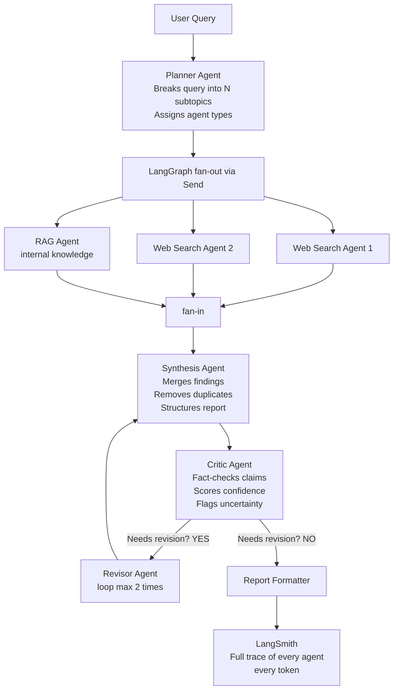

# The 4-Week Build Plan

## Week 1 — Backend Core

### Days 1–2: State + Planner Agent
Every node in your graph reads from and writes to a single shared GraphState. Design this carefully first — it's the skeleton everything hangs on.
```python
from typing import TypedDict, Annotated, List
import operator

class GraphState(TypedDict):
    query: str
    subtopics: List[str]
    research_findings: Annotated[List[dict], operator.add]  # parallel agents append here
    draft_report: str
    fact_check_results: List[dict]
    needs_revision: bool
    revision_count: int
    final_report: dict
    sources: List[str]
```
The `Annotated[List, operator.add]` is critical — it tells LangGraph that when parallel agents all write to `research_findings` simultaneously, append their results rather than overwrite each other.

### Days 3–4: Parallel Web Agents using Send()
This is the LangGraph technique that makes your project research-grade. `Send()` lets you spawn N agents at runtime based on how many subtopics the planner identified:
```python
from langgraph.constants import Send

def fan_out(state: GraphState) -> List[Send]:
    # Dynamically spawn one web agent per subtopic
    return [
        Send("web_research_agent", {
            "subtopic": topic,
            "original_query": state["query"]
        })
        for topic in state["subtopics"]
    ]

# Each agent runs in parallel, appends to research_findings
def web_research_agent(state: dict) -> dict:
    results = tavily_client.search(
        query=f"{state['original_query']} — {state['subtopic']}",
        search_depth="advanced",
        max_results=5
    )
    return {"research_findings": [{"subtopic": state["subtopic"], "data": results}]}
```

### Days 5–7: Reflexion Loop (Critic + Revisor)
This is the research paper technique. After synthesis, a Critic agent scores every major claim 0–1 for confidence. If too many claims score below 0.6, it sends the draft back for revision — up to 2 times.
```python
from pydantic import BaseModel, Field

class Claim(BaseModel):
    text: str
    confidence: float = Field(ge=0.0, le=1.0)
    flagged: bool

class CriticOutput(BaseModel):
    claims: List[Claim]
    needs_revision: bool
    revision_instructions: str

def critic_node(state: GraphState) -> dict:
    result = critic_chain.invoke({
        "report": state["draft_report"],
        "sources": state["research_findings"]
    })
    return {
        "fact_check_results": [c.dict() for c in result.claims],
        "needs_revision": result.needs_revision and state["revision_count"] < 2,
        "revision_count": state["revision_count"] + 1
    }

# Conditional edge: loop back or finish
def route_after_critic(state: GraphState) -> str:
    return "revise" if state["needs_revision"] else "format_report"
```

## Week 2 — Streaming API
FastAPI + Server-Sent Events so the frontend sees agents complete in real time:
```python
from fastapi import FastAPI
from fastapi.responses import StreamingResponse
import json, asyncio

@app.post("/research/stream")
async def stream_research(body: dict):
    async def generate():
        async for event in research_app.astream_events(
            {"query": body["query"], "revision_count": 0,
             "research_findings": [], "subtopics": []},
            version="v2"
        ):
            kind = event["event"]
            if kind == "on_chain_start":
                yield f"data: {json.dumps({'type':'agent_start','name':event['name']})}\n\n"
            elif kind == "on_chain_end":
                yield f"data: {json.dumps({'type':'agent_done','name':event['name']})}\n\n"
            elif kind == "on_chat_model_stream":
                token = event["data"]["chunk"].content
                yield f"data: {json.dumps({'type':'token','text':token})}\n\n"

    return StreamingResponse(generate(), media_type="text/event-stream")
```
LangSmith traces every call automatically — just set three env vars and it's done.

## Week 3 — Next.js Frontend
The UI you just saw, built in Next.js with live SSE streaming:
```typescript
// hooks/useResearch.ts
export function useResearch() {
  const [agents, setAgents] = useState<AgentStatus[]>(initialAgents)
  const [reportTokens, setReportTokens] = useState("")

  async function run(query: string) {
    const stream = await fetch("/api/research/stream", {
      method: "POST",
      body: JSON.stringify({ query })
    })

    const reader = stream.body!.getReader()
    const decoder = new TextDecoder()

    while (true) {
      const { value, done } = await reader.read()
      if (done) break

      const lines = decoder.decode(value).split("\n")
      for (const line of lines) {
        if (!line.startsWith("data: ")) continue
        const event = JSON.parse(line.slice(6))

        if (event.type === "agent_start")
          setAgents(a => markActive(a, event.name))
        if (event.type === "agent_done")
          setAgents(a => markDone(a, event.name))
        if (event.type === "token")
          setReportTokens(t => t + event.text)  // streams report live
      }
    }
  }

  return { agents, reportTokens, run }
}
```

## Week 4 — Polish That Seals It
Evaluation dataset in LangSmith — run 30 test queries, log every trace, build a dashboard showing hallucination rate vs naive RAG. This turns your project from "I built a thing" into "I measured a thing" — which is what senior engineers do.
Docker Compose — one command to run everything:
```yaml
services:
  backend: { build: ./backend, ports: ["8000:8000"] }
  frontend: { build: ./frontend, ports: ["3000:3000"] }
  chromadb: { image: chromadb/chroma, ports: ["8001:8001"] }
```
A killer README with your graph diagram, eval metrics, and architecture decisions. This is what gets read when someone finds your GitHub after an interview.

---

# Multi-Agent Enterprise Research Intelligence Platform

### The One-Line Pitch
"An autonomous multi-agent system that researches any business topic by orchestrating specialized AI agents in parallel, synthesizes findings into structured intelligence reports, fact-checks its own output, and delivers everything through a real-time streaming dashboard — built on LangGraph, LangChain, and fully observable via LangSmith."

### Why This Is The Perfect Project

| Dimension | Why it works |
| --- | --- |
| **Enterprise utility** | Every company — consulting, finance, legal, automotive — needs research synthesis. This is immediately relatable to any interviewer. |
| **Research depth** | You implement: multi-agent orchestration, LLM-as-Judge fact checking, adaptive parallelism, reflection loops — all named techniques from 2023–2024 papers |
| **Demo-ability** | A user types one query. They watch 6 agents light up on screen in real-time, doing work in parallel. A beautiful structured report appears live. This is a jaw-drop demo. |
| **Resume fit** | Directly extends your TCS multi-agent + RAG work. 100% believable as org work. |

### What It Looks Like (The Demo)
User types: "Analyze the competitive landscape of EV battery technology for a Japanese OEM entering the Indian market"
Then on screen, in real-time:
```plaintext
🔍 Planner Agent         ✅ Research plan created (6 subtopics identified)
├── 🌐 Web Agent 1       ⟳ Searching: "EV battery manufacturers India 2024"
├── 🌐 Web Agent 2       ⟳ Searching: "Japanese OEM India EV strategy"
├── 🌐 Web Agent 3       ⟳ Searching: "lithium ion supply chain India"
├── 📄 RAG Agent         ⟳ Querying internal knowledge base...
└── 🔢 Analyst Agent     ⏳ Waiting for data...

✅ All research complete
🧠 Synthesis Agent       ⟳ Synthesizing 24 sources...
🔎 Critic Agent          ⟳ Fact-checking 8 key claims...
📝 Report Agent          ⟳ Formatting final report...

━━━━━━━━━━━━━━━━━━━━━━━━━━━
📊 INTELLIGENCE REPORT READY
━━━━━━━━━━━━━━━━━━━━━━━━━━━
```
A structured, cited, formatted report appears — with confidence scores on each claim, flagged uncertainties, and source citations. All of this streaming live to the UI.

### The Architecture


### The Research Techniques You'll Name-Drop

| Technique | Paper / Origin | Where you use it |
| --- | --- | --- |
| **Multi-agent parallelism** | LangGraph Send() API | Fan-out to N web search agents simultaneously |
| **Reflexion** | Shinn et al., 2023 | Critic agent reviews and requests revision in a loop |
| **LLM-as-Judge** | Zheng et al., 2023 | Critic scores each claim 0–1 for confidence |
| **Plan-and-Execute** | Wang et al., 2023 | Planner decomposes query before execution |
| **Self-RAG** | Asai et al., 2023 | RAG agent grades its own retrieved docs |
| **MapReduce over agents** | Classic distributed systems | Parallel research → single synthesis |

You can cite all of these in your README and in interviews
